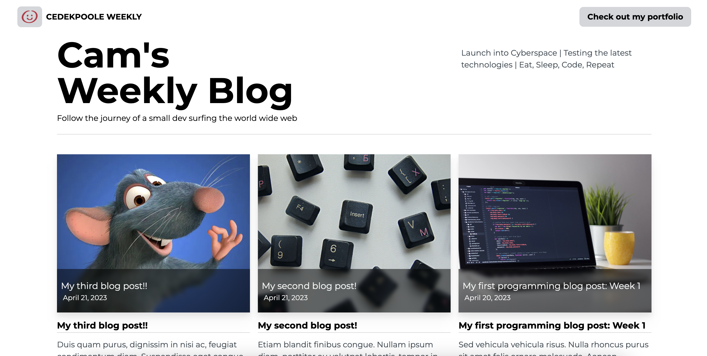
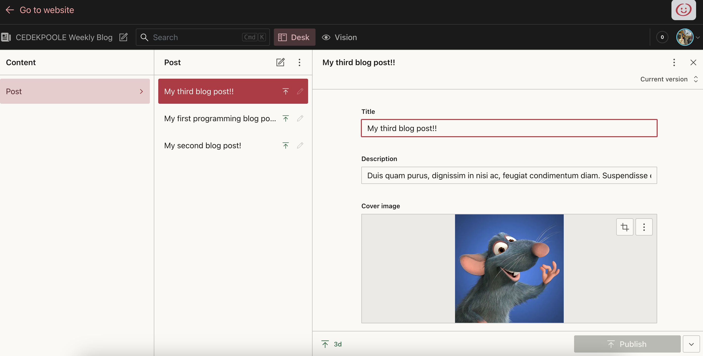

# CEDEKPOOLE Weekly Blog

## Description

This is a weekly blog that will be updated every week with new programming content. This includes but is not limited to: new projects, new technologies, and new ideas for other potential projects. This will be used as means to keep up with my progress as a developer and to keep track of my ideas. 

#### Technologies Used
- React.js
- Tailwind CSS
- TypeScript
- Sanity v3 (Headless CMS)
- Vercel (Hosting)
- Next.js 13 (Static Site Generation)

I built a fully responsive website using React.js and Tailwind CSS. I used Sanity as a headless CMS to store all of my blog posts and learnt how to use the GROQ query language to fetch the blog post content that had been made available via Sanity's public API. I also customised the initial sanity studio and used Authentication to allow access to only a certain number of members. I used Next.js 13 to statically generate the website and to make use of the new Next.js App folder structure. I also used TypeScript to type check my code and to make sure that I was using the correct data types. Lastly, the site is hosted on Vercel - the creators of Next.js.

## Installation

N/A - This is a website that is hosted on Vercel.

## Usage

#### How to use the website (Normal User)
- Visit the website at: https://webdev-blog-eta.vercel.app/
- Click on the blog post that you would like to read
- Read the blog post
- Check out links in the footer to see my other projects and social media 

#### How to use the website (Admin User)
- Visit the website at: https://webdev-blog-eta.vercel.app/studio
- You will be prompted to login via your github account/email
- Once logged in, you will be able to create new blog posts and edit existing ones
- You can also add new members to the studio and give them access to the studio

## Screenshots

Screenshot of main Website:

Screenshot of Sanity Studio:

## License
MIT License - see the License file for more details.

## Contributing
If you would like to contribute to this project, please follow the rules of the [Contributor Covenant](https://www.contributor-covenant.org/)

## Credits 
- The main premise of this project came from [Sonny Sangha](https://www.papareact.com/)

---

## Roadmap
This blog will be uploaded every week with new and (hopefully) interesting content. I will also be adding new features to the website as I learn more about web development.

## Questions
If you have any questions, please contact me via email at: cameron.edek.poole@gmail.com
You are also welcome to follow and message me on [LinkedIn](https://www.linkedin.com/in/cam-edek-poole/) or contact me via [this form](https://cedekpoole.com/contact)

